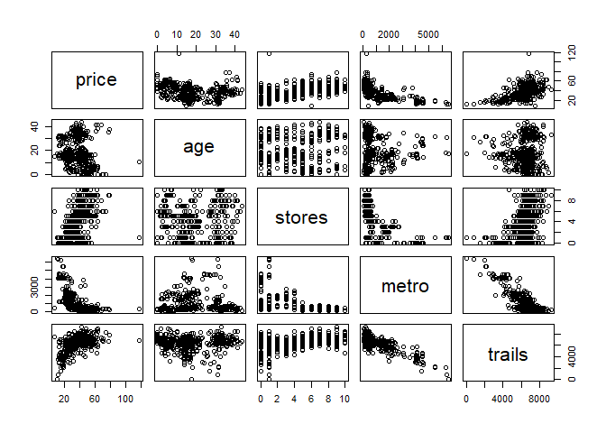
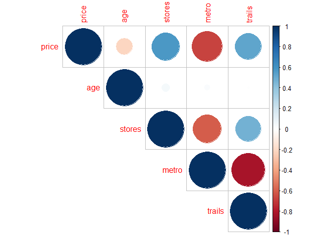
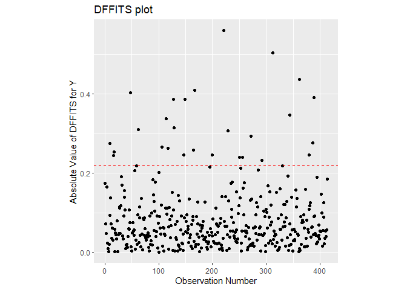
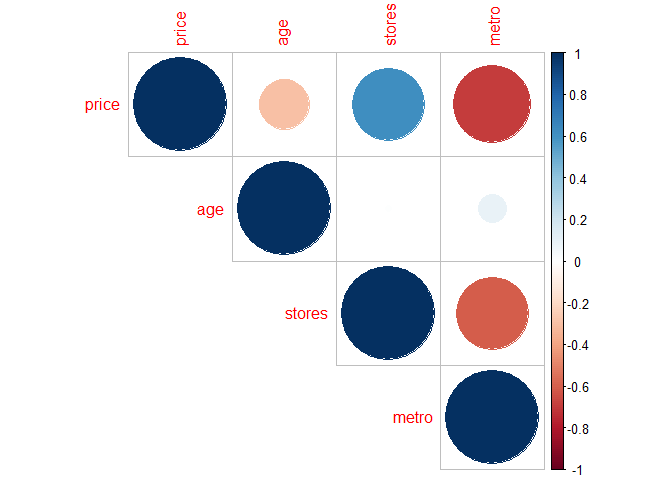

Exam 2
================
<center>  
Garrett Springer  
<center>

<style type="text/css">
h1.title {
  font-size: 40px;
  text-align: center;
}
</style>

## Exam Instructions

Use this .rmd file to perform your analysis. You will answer questions
about this data set through a Canvas Quiz. You will then submit your
completed .rmd and .html file at the end of the Canvas quiz. Your code
should be organized, properly formatted, and you should only print out
relevant items (e.g. do not print out the entire data set for me to see,
and do not use the `View()` function).

## Data and Description

Researchers collected data on 414 homes in China. The goal is to use
rather unique explanatory variables to predict house price (measured in
cost (US Dollars) per unit area). The following are predictor variables:

| Variable | Description                                                             |
|----------|-------------------------------------------------------------------------|
| age      | Age of the house (number of years since being built) in years           |
| stores   | Number of convenience stores within a 500 meter circle around the house |
| metro    | Distance from the house to the nearest metro station (in meters)        |
| trails   | Distance from the house to the nearest walking trail (in meters)        |

Download the RealEstate.txt file from Canvas (Files -\> DATA SETS), and
put it in the same folder as this R Markdown file.

### Complete your exploratory data analysis (EDA) in this section. You may use multiple code chunks, if you wish, to organize your code.

``` r
realEstate <- read_table("RealEstate.txt")
```

    ## 
    ## -- Column specification --------------------------------------------------------
    ## cols(
    ##   age = col_double(),
    ##   price = col_double(),
    ##   stores = col_double(),
    ##   metro = col_double(),
    ##   trails = col_double()
    ## )

``` r
summary(realEstate)
```

    ##       age             price            stores           metro        
    ##  Min.   : 0.000   Min.   :  7.60   Min.   : 0.000   Min.   :  23.38  
    ##  1st Qu.: 9.025   1st Qu.: 27.70   1st Qu.: 1.000   1st Qu.: 289.32  
    ##  Median :16.100   Median : 38.45   Median : 4.000   Median : 492.23  
    ##  Mean   :17.713   Mean   : 37.98   Mean   : 4.094   Mean   :1083.89  
    ##  3rd Qu.:28.150   3rd Qu.: 46.60   3rd Qu.: 6.000   3rd Qu.:1454.28  
    ##  Max.   :43.800   Max.   :117.50   Max.   :10.000   Max.   :6488.02  
    ##      trails    
    ##  Min.   :  15  
    ##  1st Qu.:5877  
    ##  Median :6550  
    ##  Mean   :6306  
    ##  3rd Qu.:7069  
    ##  Max.   :9231

``` r
realEstate <- realEstate[,c(2,1,3,4,5)]

realEstate %>% 
  group_by(stores) %>% 
  summarise(var_price = var(price)) %>% 
  arrange(var_price)
```

    ## # A tibble: 11 x 2
    ##    stores var_price
    ##     <dbl>     <dbl>
    ##  1     10      40.0
    ##  2      2      59.0
    ##  3      7      63.6
    ##  4      3      67.3
    ##  5      5      75.6
    ##  6      8      80.4
    ##  7      4      81.2
    ##  8      9     137. 
    ##  9      0     145. 
    ## 10      6     168. 
    ## 11      1     266.

``` r
plot(realEstate)
```

<!-- -->

``` r
corrplot(cor(realEstate), type = "upper")
```

<!-- -->

``` r
cor(realEstate)
```

    ##             price          age      stores       metro       trails
    ## price   1.0000000 -0.210567046  0.57100491 -0.67361286  0.526497829
    ## age    -0.2105670  1.000000000  0.04959251  0.02562205  0.003644024
    ## stores  0.5710049  0.049592513  1.00000000 -0.60251914  0.479347226
    ## metro  -0.6736129  0.025622047 -0.60251914  1.00000000 -0.830000000
    ## trails  0.5264978  0.003644024  0.47934723 -0.83000000  1.000000000

### Fit an inital model, and check the “(A) no influential points” assumption in this section. You may use multiple code chunks, if you wish, to organize your code.

``` r
lm_realEstate <- lm(realEstate)
summary(lm_realEstate)
```

    ## 
    ## Call:
    ## lm(formula = realEstate)
    ## 
    ## Residuals:
    ##     Min      1Q  Median      3Q     Max 
    ## -36.831  -5.360  -1.508   4.207  77.139 
    ## 
    ## Coefficients:
    ##               Estimate Std. Error t value Pr(>|t|)    
    ## (Intercept) 48.3339770  4.8388928   9.989  < 2e-16 ***
    ## age         -0.2505982  0.0401366  -6.244 1.07e-09 ***
    ## stores       1.2861069  0.1944583   6.614 1.17e-10 ***
    ## metro       -0.0060168  0.0007140  -8.427 6.10e-16 ***
    ## trails      -0.0007388  0.0006395  -1.155    0.249    
    ## ---
    ## Signif. codes:  0 '***' 0.001 '**' 0.01 '*' 0.05 '.' 0.1 ' ' 1
    ## 
    ## Residual standard error: 9.248 on 409 degrees of freedom
    ## Multiple R-squared:  0.5426, Adjusted R-squared:  0.5381 
    ## F-statistic: 121.3 on 4 and 409 DF,  p-value: < 2.2e-16

``` r
calc_df_betas <- function(df, value_string, lm){
  
  df$dfbetas_value_string <- as.vector(dfbetas(lm)[, value_string])
  
  thing <- df %>% 
    mutate(rowNum = row.names(df)) %>%  
    filter(abs(dfbetas_value_string) > 2 * sqrt(length(lm$coefficients) / 
                                    length(dfbetas_value_string))) %>%
    arrange(desc(abs(dfbetas_value_string)))
  
  
  print(paste("dfbetas for", value_string))
  print(thing)
  
  #PLOT
  y_lab <- paste("Abs(DFBETAS) for ", value_string)
  
  ggplot(data = df) + 
  geom_point(mapping = aes(x = as.numeric(rownames(df)), 
                           y = abs(dfbetas_value_string))) +
  ylab(y_lab) +
  xlab("Observation Number") +
  # for n > 30
  geom_hline(mapping = aes(yintercept = 2 / sqrt(length(dfbetas_value_string))),
             color = "red", 
             linetype = "dashed") + 
  # for n <= 30
  geom_hline(mapping = aes(yintercept = 1),
             color = "red", 
             linetype = "dashed") +
  theme(aspect.ratio = 1)
  
}


dfBetas_age <- calc_df_betas(realEstate, "age", lm_realEstate)
```

    ## [1] "dfbetas for age"
    ## # A tibble: 8 x 7
    ##   price   age stores metro trails dfbetas_value_string rowNum
    ##   <dbl> <dbl>  <dbl> <dbl>  <dbl>                <dbl> <chr> 
    ## 1  78.3  37.2      9  187.  7714.                0.297 221   
    ## 2  62.9  38.6      4  805.  6108.                0.294 127   
    ## 3  67.7  40.9      8  122.  7284.                0.272 390   
    ## 4  78    35.4      9  319.  6674.                0.270 313   
    ## 5  61.5  35.9      3  641.  5812.                0.250 48    
    ## 6  63.3  41.4      8  281.  8349.                0.241 362   
    ## 7  60.7  41.3      6  125.  6689.                0.237 129   
    ## 8  73.6   0        6  293.  8174.               -0.229 167

``` r
dfBetas_stores <- calc_df_betas(realEstate, "stores", lm_realEstate)
```

    ## [1] "dfbetas for stores"
    ## # A tibble: 3 x 7
    ##   price   age stores metro trails dfbetas_value_string rowNum
    ##   <dbl> <dbl>  <dbl> <dbl>  <dbl>                <dbl> <chr> 
    ## 1 118.   10.8      1  253.  6813.               -0.815 271   
    ## 2  78.3  37.2      9  187.  7714.                0.277 221   
    ## 3  78    35.4      9  319.  6674.                0.276 313

``` r
dfBetas_metro <- calc_df_betas(realEstate, "metro", lm_realEstate)
```

    ## [1] "dfbetas for metro"
    ## # A tibble: 2 x 7
    ##   price   age stores metro trails dfbetas_value_string rowNum
    ##   <dbl> <dbl>  <dbl> <dbl>  <dbl>                <dbl> <chr> 
    ## 1 118.   10.8      1  253.  6813.               -0.576 271   
    ## 2  61.5  35.9      3  641.  5812.               -0.225 48

``` r
dfBetas_trails <- calc_df_betas(realEstate, "trails", lm_realEstate)
```

    ## [1] "dfbetas for trails"
    ## # A tibble: 3 x 7
    ##   price   age stores metro trails dfbetas_value_string rowNum
    ##   <dbl> <dbl>  <dbl> <dbl>  <dbl>                <dbl> <chr> 
    ## 1  73.6   0        6  293.  8174.                0.247 167   
    ## 2  63.2   5.3      6  260.  8816.                0.237 62    
    ## 3  63.3  41.4      8  281.  8349.                0.237 362

``` r
grid.arrange(dfBetas_age, dfBetas_metro, dfBetas_stores, dfBetas_trails)
```

<!-- -->

``` r
calc_df_fits <- function(df, lm){
  
    df$dffits <- dffits(lm)
  
  plot <- ggplot(data = df) + 
    geom_point(mapping = aes(x = as.numeric(rownames(df)), 
                             y = abs(dffits))) +
    ylab("Absolute Value of DFFITS for Y") +
    xlab("Observation Number") +
    geom_hline(mapping = aes(yintercept = 2 *  sqrt(length(lm$coefficients) / length(dffits))),
               color = "red", 
               linetype = "dashed") +
    theme(aspect.ratio = 1) + 
    labs(title = "DFFITS plot")
  
  thing <- df %>% 
    mutate(rowNum = row.names(df)) %>%  
    filter(abs(dffits) > 2 * sqrt(length(lm$coefficients) / 
                                    length(dffits))) %>%
    arrange(desc(abs(dffits)))
  
  out <- list(plot, thing)
  return(out)
  
}


calc_df_fits(realEstate, lm_realEstate)
```

    ## [[1]]

<!-- -->

    ## 
    ## [[2]]
    ## # A tibble: 24 x 7
    ##    price   age stores metro trails dffits rowNum
    ##    <dbl> <dbl>  <dbl> <dbl>  <dbl>  <dbl> <chr> 
    ##  1 118.   10.8      1  253.  6813.  1.02  271   
    ##  2  78.3  37.2      9  187.  7714.  0.515 221   
    ##  3  78    35.4      9  319.  6674.  0.463 313   
    ##  4  63.3  41.4      8  281.  8349.  0.405 362   
    ##  5  73.6   0        6  293.  8174.  0.370 167   
    ##  6  61.5  35.9      3  641.  5812.  0.360 48    
    ##  7  67.7  40.9      8  122.  7284.  0.359 390   
    ##  8  45.1  16.4      0 3781.  4350.  0.352 149   
    ##  9  62.9  38.6      4  805.  6108.  0.348 127   
    ## 10  41.2  34.6      0 3085.  4662.  0.314 345   
    ## # i 14 more rows

It looks like the data value at row 271 is definitely an influential
point. The dffits shows that influential point, and the dfbetas show
observation number 271 as an influential point on plots for metro and
store. This assumption is not met

### Fit a model on a new data set where the one influential point is removed, and check the “no multicollinearity” assumption, in this section. You may use multiple code chunks, if you wish, to organize your code.

``` r
realEstate_new <- realEstate[-271,]
lm_realEstate_new <- lm(realEstate_new)


dfBetas_age <- calc_df_betas(realEstate_new, "age", lm_realEstate_new)
```

    ## [1] "dfbetas for age"
    ## # A tibble: 8 x 7
    ##   price   age stores metro trails dfbetas_value_string rowNum
    ##   <dbl> <dbl>  <dbl> <dbl>  <dbl>                <dbl> <chr> 
    ## 1  62.9  38.6      4  805.  6108.                0.325 127   
    ## 2  78.3  37.2      9  187.  7714.                0.323 221   
    ## 3  67.7  40.9      8  122.  7284.                0.296 389   
    ## 4  78    35.4      9  319.  6674.                0.295 312   
    ## 5  61.5  35.9      3  641.  5812.                0.279 48    
    ## 6  60.7  41.3      6  125.  6689.                0.261 129   
    ## 7  63.3  41.4      8  281.  8349.                0.260 361   
    ## 8  73.6   0        6  293.  8174.               -0.254 167

``` r
dfBetas_stores <- calc_df_betas(realEstate_new, "stores", lm_realEstate_new)
```

    ## [1] "dfbetas for stores"
    ## # A tibble: 2 x 7
    ##   price   age stores metro trails dfbetas_value_string rowNum
    ##   <dbl> <dbl>  <dbl> <dbl>  <dbl>                <dbl> <chr> 
    ## 1  78.3  37.2      9  187.  7714.                0.302 221   
    ## 2  78    35.4      9  319.  6674.                0.301 312

``` r
dfBetas_metro <- calc_df_betas(realEstate_new, "metro", lm_realEstate_new)
```

    ## [1] "dfbetas for metro"
    ## # A tibble: 2 x 7
    ##   price   age stores metro trails dfbetas_value_string rowNum
    ##   <dbl> <dbl>  <dbl> <dbl>  <dbl>                <dbl> <chr> 
    ## 1  61.5  35.9      3  641.  5812.               -0.252 48    
    ## 2  45.1  16.4      0 3781.  4350.                0.221 149

``` r
dfBetas_trails <- calc_df_betas(realEstate_new, "trails", lm_realEstate_new)
```

    ## [1] "dfbetas for trails"
    ## # A tibble: 3 x 7
    ##   price   age stores metro trails dfbetas_value_string rowNum
    ##   <dbl> <dbl>  <dbl> <dbl>  <dbl>                <dbl> <chr> 
    ## 1  73.6   0        6  293.  8174.                0.273 167   
    ## 2  63.2   5.3      6  260.  8816.                0.262 62    
    ## 3  63.3  41.4      8  281.  8349.                0.256 361

``` r
grid.arrange(dfBetas_age, dfBetas_metro, dfBetas_stores, dfBetas_trails)
```

<!-- -->

``` r
calc_df_fits(realEstate_new, lm_realEstate_new)
```

    ## [[1]]

<!-- -->

    ## 
    ## [[2]]
    ## # A tibble: 27 x 7
    ##    price   age stores metro trails dffits rowNum
    ##    <dbl> <dbl>  <dbl> <dbl>  <dbl>  <dbl> <chr> 
    ##  1  78.3  37.2      9  187.  7714.  0.560 221   
    ##  2  78    35.4      9  319.  6674.  0.505 312   
    ##  3  63.3  41.4      8  281.  8349.  0.437 361   
    ##  4  73.6   0        6  293.  8174.  0.410 167   
    ##  5  61.5  35.9      3  641.  5812.  0.403 48    
    ##  6  67.7  40.9      8  122.  7284.  0.391 389   
    ##  7  45.1  16.4      0 3781.  4350.  0.387 149   
    ##  8  62.9  38.6      4  805.  6108.  0.386 127   
    ##  9  41.2  34.6      0 3085.  4662.  0.347 344   
    ## 10   7.6  14.8      6  393.  7504. -0.338 114   
    ## # i 17 more rows

With the influential point removed, the no influential points assumption
is met. The dffits and dfbetas plots show no influential points

``` r
plot(realEstate_new)
```

<!-- -->

``` r
corrplot(cor(realEstate_new), type = "upper")
```

<!-- -->

``` r
vif(lm_realEstate_new)
```

    ##      age   stores    metro   trails 
    ## 1.009291 1.592574 3.932695 3.228700

The no multicolineaerioty assumption is not met. We can see a
multicollinearity issue between metro and trails on the correlation
matrix and the scatterplot matrix shows that relationship too. The VIFs
are not super big but the average of all of them is greater than 1 so
that also shows a problem

### Fit another model (on the new data set where the one influential point is removed) with the age variable square rooted (do not use the original age variable) in this section.

``` r
realEstate_sqrtage <- realEstate_new %>% 
  mutate(age = sqrt(age))


lm_realEstate_sqrtage <- lm(realEstate_sqrtage)

summary(lm_realEstate_sqrtage)
```

    ## 
    ## Call:
    ## lm(formula = realEstate_sqrtage)
    ## 
    ## Residuals:
    ##     Min      1Q  Median      3Q     Max 
    ## -36.031  -5.248  -1.264   4.052  34.104 
    ## 
    ## Coefficients:
    ##               Estimate Std. Error t value Pr(>|t|)    
    ## (Intercept) 50.2432792  4.3654110  11.509  < 2e-16 ***
    ## age         -2.1144686  0.2613058  -8.092 6.81e-15 ***
    ## stores       1.4477069  0.1738040   8.330 1.25e-15 ***
    ## metro       -0.0054377  0.0006385  -8.516 3.21e-16 ***
    ## trails      -0.0006697  0.0005692  -1.177     0.24    
    ## ---
    ## Signif. codes:  0 '***' 0.001 '**' 0.01 '*' 0.05 '.' 0.1 ' ' 1
    ## 
    ## Residual standard error: 8.234 on 408 degrees of freedom
    ## Multiple R-squared:  0.6056, Adjusted R-squared:  0.6017 
    ## F-statistic: 156.6 on 4 and 408 DF,  p-value: < 2.2e-16

``` r
realEstate_sqrtage <- realEstate_sqrtage[,c(2,3,4,5,1)]
```

### Perform variable selection in this section. You may use multiple code chunks, if you wish, to organize your code.

``` r
# convert from tibble to dataframe for varibale selection

realEstate_sqrtage <- as.data.frame(realEstate_sqrtage)


#lasso
lasso <- function(df){
  col <- ncol(df)
  df_x <- as.matrix(df[, 1:col -1])
  df_y <- df[,col]

  # use cross validation to pick the "best" (based on MSE) lambda
  df_ridge_cv <- cv.glmnet(x = df_x,
                            y = df_y, 
                            type.measure = "mse", 
                            alpha = 1) 
  df_ridge_cv$lambda.1se
  coef(df_ridge_cv, s = "lambda.1se")
}

print("LASSO")
```

    ## [1] "LASSO"

``` r
print(lasso(realEstate_sqrtage))
```

    ## 5 x 1 sparse Matrix of class "dgCMatrix"
    ##                       s1
    ## (Intercept) 42.340556287
    ## age         -1.087190470
    ## stores       1.044167528
    ## metro       -0.004222634
    ## trails       .

``` r
#best subsets
best_subsets <- bestglm(realEstate_sqrtage,
                IC = "BIC",
                method = "exhaustive")


print("Best Subsets")
```

    ## [1] "Best Subsets"

``` r
print(summary(best_subsets$BestModel))
```

    ## 
    ## Call:
    ## lm(formula = y ~ ., data = data.frame(Xy[, c(bestset[-1], FALSE), 
    ##     drop = FALSE], y = y))
    ## 
    ## Residuals:
    ##     Min      1Q  Median      3Q     Max 
    ## -36.453  -5.206  -1.317   4.308  33.679 
    ## 
    ## Coefficients:
    ##               Estimate Std. Error t value Pr(>|t|)    
    ## (Intercept) 45.3932499  1.4373253  31.582  < 2e-16 ***
    ## age         -2.1256800  0.2612546  -8.136 4.94e-15 ***
    ## stores       1.4580841  0.1736616   8.396 7.64e-16 ***
    ## metro       -0.0048585  0.0004068 -11.942  < 2e-16 ***
    ## ---
    ## Signif. codes:  0 '***' 0.001 '**' 0.01 '*' 0.05 '.' 0.1 ' ' 1
    ## 
    ## Residual standard error: 8.238 on 409 degrees of freedom
    ## Multiple R-squared:  0.6042, Adjusted R-squared:  0.6013 
    ## F-statistic: 208.1 on 3 and 409 DF,  p-value: < 2.2e-16

``` r
#elastic net
elasticNet <- function(df){
  col <- ncol(df)
  df_x <- as.matrix(df[, 1:col -1])
  df_y <- df[,col]
  df_ridge_cv <- cv.glmnet(x = df_x,
                            y = df_y, 
                            type.measure = "mse", 
                            alpha = .5) 
  df_ridge_cv$lambda.1se
  coef(df_ridge_cv, s = "lambda.1se")
}

print("Elastic Net")
```

    ## [1] "Elastic Net"

``` r
print(elasticNet(realEstate_sqrtage))
```

    ## 5 x 1 sparse Matrix of class "dgCMatrix"
    ##                       s1
    ## (Intercept) 42.132008057
    ## age         -1.167411703
    ## stores       1.096956912
    ## metro       -0.003941162
    ## trails       .

All three of those models exclude trails and include age, stores, and
metro in the model. Therefore I will use age stores and metro in my
model.

### Fit a model with any variables removed that you deem unnecesary for the model in this section.

``` r
lm_realEstate <- lm(realEstate_sqrtage %>% select(price, age, stores, metro))
summary(lm_realEstate)
```

    ## 
    ## Call:
    ## lm(formula = realEstate_sqrtage %>% select(price, age, stores, 
    ##     metro))
    ## 
    ## Residuals:
    ##     Min      1Q  Median      3Q     Max 
    ## -36.453  -5.206  -1.317   4.308  33.679 
    ## 
    ## Coefficients:
    ##               Estimate Std. Error t value Pr(>|t|)    
    ## (Intercept) 45.3932499  1.4373253  31.582  < 2e-16 ***
    ## age         -2.1256800  0.2612546  -8.136 4.94e-15 ***
    ## stores       1.4580841  0.1736616   8.396 7.64e-16 ***
    ## metro       -0.0048585  0.0004068 -11.942  < 2e-16 ***
    ## ---
    ## Signif. codes:  0 '***' 0.001 '**' 0.01 '*' 0.05 '.' 0.1 ' ' 1
    ## 
    ## Residual standard error: 8.238 on 409 degrees of freedom
    ## Multiple R-squared:  0.6042, Adjusted R-squared:  0.6013 
    ## F-statistic: 208.1 on 3 and 409 DF,  p-value: < 2.2e-16

### Determine if any interaction(s) are needed for this model in this section. You may use multiple code chunks, if you wish, to organize your code.

``` r
lm_realEstate_int_all <- lm(price ~ age*stores + age*metro + metro*stores, 
                            data = realEstate_sqrtage)

lm_realEstate_int_stores <- lm(price ~ age*stores + metro*stores, 
                               data =realEstate_sqrtage)
lm_realEstate_int_age <-  lm(price ~ age*metro + age*stores,
                             data = realEstate_sqrtage)
lm_realEstate_int_metro <- lm(price ~ age*metro + metro*stores,
                              data = realEstate_sqrtage)

summary(lm_realEstate_int_all)
```

    ## 
    ## Call:
    ## lm(formula = price ~ age * stores + age * metro + metro * stores, 
    ##     data = realEstate_sqrtage)
    ## 
    ## Residuals:
    ##     Min      1Q  Median      3Q     Max 
    ## -36.374  -4.535  -0.789   3.918  33.183 
    ## 
    ## Coefficients:
    ##                Estimate Std. Error t value Pr(>|t|)    
    ## (Intercept)  49.7291305  2.5265561  19.683  < 2e-16 ***
    ## age          -3.1128259  0.5840790  -5.329 1.64e-07 ***
    ## stores        1.4786154  0.3967870   3.726 0.000222 ***
    ## metro        -0.0083722  0.0014812  -5.652 2.99e-08 ***
    ## age:stores    0.0835203  0.0895952   0.932 0.351789    
    ## age:metro     0.0010328  0.0003256   3.172 0.001631 ** 
    ## stores:metro -0.0012075  0.0002165  -5.578 4.45e-08 ***
    ## ---
    ## Signif. codes:  0 '***' 0.001 '**' 0.01 '*' 0.05 '.' 0.1 ' ' 1
    ## 
    ## Residual standard error: 7.834 on 406 degrees of freedom
    ## Multiple R-squared:  0.6446, Adjusted R-squared:  0.6394 
    ## F-statistic: 122.8 on 6 and 406 DF,  p-value: < 2.2e-16

``` r
anova(lm_realEstate_sqrtage, lm_realEstate_int_all)
```

    ## Analysis of Variance Table
    ## 
    ## Model 1: price ~ age + stores + metro + trails
    ## Model 2: price ~ age * stores + age * metro + metro * stores
    ##   Res.Df   RSS Df Sum of Sq      F    Pr(>F)    
    ## 1    408 27660                                  
    ## 2    406 24919  2    2740.7 22.327 6.317e-10 ***
    ## ---
    ## Signif. codes:  0 '***' 0.001 '**' 0.01 '*' 0.05 '.' 0.1 ' ' 1

``` r
#all interactions is better than none
anova(lm_realEstate_int_all, lm_realEstate_int_age)
```

    ## Analysis of Variance Table
    ## 
    ## Model 1: price ~ age * stores + age * metro + metro * stores
    ## Model 2: price ~ age * metro + age * stores
    ##   Res.Df   RSS Df Sum of Sq      F    Pr(>F)    
    ## 1    406 24919                                  
    ## 2    407 26829 -1   -1909.7 31.114 4.449e-08 ***
    ## ---
    ## Signif. codes:  0 '***' 0.001 '**' 0.01 '*' 0.05 '.' 0.1 ' ' 1

``` r
anova(lm_realEstate_int_all, lm_realEstate_int_stores)
```

    ## Analysis of Variance Table
    ## 
    ## Model 1: price ~ age * stores + age * metro + metro * stores
    ## Model 2: price ~ age * stores + metro * stores
    ##   Res.Df   RSS Df Sum of Sq     F   Pr(>F)   
    ## 1    406 24919                               
    ## 2    407 25536 -1   -617.42 10.06 0.001631 **
    ## ---
    ## Signif. codes:  0 '***' 0.001 '**' 0.01 '*' 0.05 '.' 0.1 ' ' 1

``` r
anova(lm_realEstate_int_all, lm_realEstate_int_metro)
```

    ## Analysis of Variance Table
    ## 
    ## Model 1: price ~ age * stores + age * metro + metro * stores
    ## Model 2: price ~ age * metro + metro * stores
    ##   Res.Df   RSS Df Sum of Sq     F Pr(>F)
    ## 1    406 24919                          
    ## 2    407 24972 -1   -53.335 0.869 0.3518

``` r
#just interaction between metro and age and metro and stores is better

anova(lm_realEstate_sqrtage, lm_realEstate_int_metro)
```

    ## Analysis of Variance Table
    ## 
    ## Model 1: price ~ age + stores + metro + trails
    ## Model 2: price ~ age * metro + metro * stores
    ##   Res.Df   RSS Df Sum of Sq    F   Pr(>F)    
    ## 1    408 27660                               
    ## 2    407 24972  1    2687.4 43.8 1.15e-10 ***
    ## ---
    ## Signif. codes:  0 '***' 0.001 '**' 0.01 '*' 0.05 '.' 0.1 ' ' 1

``` r
summary(lm_realEstate_int_metro)
```

    ## 
    ## Call:
    ## lm(formula = price ~ age * metro + metro * stores, data = realEstate_sqrtage)
    ## 
    ## Residuals:
    ##     Min      1Q  Median      3Q     Max 
    ## -36.403  -4.588  -0.634   3.914  33.812 
    ## 
    ## Coefficients:
    ##                Estimate Std. Error t value Pr(>|t|)    
    ## (Intercept)  47.9103614  1.6050012  29.851  < 2e-16 ***
    ## age          -2.6490728  0.3059862  -8.657  < 2e-16 ***
    ## metro        -0.0079081  0.0013948  -5.670 2.72e-08 ***
    ## stores        1.8078709  0.1807658  10.001  < 2e-16 ***
    ## age:metro     0.0009163  0.0003006   3.048  0.00246 ** 
    ## metro:stores -0.0012034  0.0002164  -5.561 4.87e-08 ***
    ## ---
    ## Signif. codes:  0 '***' 0.001 '**' 0.01 '*' 0.05 '.' 0.1 ' ' 1
    ## 
    ## Residual standard error: 7.833 on 407 degrees of freedom
    ## Multiple R-squared:  0.6439, Adjusted R-squared:  0.6395 
    ## F-statistic: 147.2 on 5 and 407 DF,  p-value: < 2.2e-16

``` r
realEstate_sqrtage$residuals <- lm_realEstate_int_metro$residuals
```

First I tested all possible interactions, that did better than the
original model. Then the only test that produces a large pvalue when
compared to the model with all interactions is the one with only a metro
interactions with the others. So that means that compared to a model
with just interactions between metro and store and metro and age, the
model with all interactions does worse.

### Complete statistical inference based on the best linear model you chose in this section. You may use multiple code chunks, if you wish, to organize your code.

#### Check assumptions

##### Linearity

``` r
#partial regression
avPlots(lm_realEstate_int_metro)
```

<!-- -->

``` r
#scatterplot
plot(realEstate_sqrtage %>% select(price, age, stores, metro))
```

<!-- -->
I would say this assumption is met. Accoring to the partial regression
plot (which shows linearity in the plots) and the scatterplot matrix
which also shows linearity.

##### Independance

This is met. I would say that the variables do not effect how the others
are collected

##### Normaility

``` r
check_normality <- function(df, lm){
  # boxplot
  boxplot <- ggplot(df, mapping = aes(x = residuals)) +
  geom_boxplot()+
  theme(aspect.ratio = 1)
  
  # histogram
  hist <- df %>% 
  ggplot() +
  geom_histogram(mapping = aes(x = residuals, y = ..density..)) +
  stat_function(fun = dnorm, color = "red", size = 2,
                args = list(mean = mean(df$residuals),
                            sd = sd(df$residuals))) +
  theme(aspect.ratio = 1)
  
  
  #qqplot
  qqplot <- autoplot(lm, which = 2, ncol = 1, nrow = 1) +
  theme(aspect.ratio = 1)
  
  # shapiro-wilk
  shapwilk <- shapiro.test(lm$residuals)
  
  out <- list(boxplot, hist, qqplot, shapwilk)
  
  return(out)
}

check_normality(realEstate_sqrtage %>% select(price, age, stores, metro, residuals), lm_realEstate_int_metro)
```

    ## [[1]]

<!-- -->

    ## 
    ## [[2]]

    ## `stat_bin()` using `bins = 30`. Pick better value with `binwidth`.

<!-- -->

    ## 
    ## [[3]]

<!-- -->

    ## 
    ## [[4]]
    ## 
    ##  Shapiro-Wilk normality test
    ## 
    ## data:  lm$residuals
    ## W = 0.94995, p-value = 1.314e-10

I will assume that this assumption is met. While the qqplot shows some
deviation on the ends, the histogram and boxplot show general normality.
And while the shapiro wilk test gives evidence to say that it is not
normally distributed, we will go on with our analysis.

##### Equal Variance

``` r
autoplot(lm_realEstate_int_metro, which = 1, ncol = 1, nrow = 1) +
  theme(aspect.ratio = 1)
```

<!-- -->
This assumption is met, the points create a cloudlike shape.

##### No influential points

``` r
dfBetas_age <- calc_df_betas(realEstate_sqrtage, "age", lm_realEstate_int_metro)
```

    ## [1] "dfbetas for age"
    ##        age stores    metro   trails price residuals dfbetas_value_string rowNum
    ## 1 6.099180      9 186.5101 7714.252  78.3  32.72859            0.3386167    221
    ## 2 0.000000      6 292.9978 8173.907  73.6  19.27499           -0.3193878    167
    ## 3 5.949790      9 318.5292 6673.691  78.0  33.81250            0.2902484    312
    ## 4 6.395311      8 122.3619 7283.962  67.7  23.69693            0.2883822    389
    ## 5 0.000000      6 292.9978 7110.073  71.0  16.67499           -0.2757709    106
    ## 6 0.000000      6 292.9978 6632.790  70.1  15.77499           -0.2607293     17
    ## 7 0.000000      6 292.9978 6759.043  69.7  15.37499           -0.2540527    379
    ## 8 6.426508      6 124.9912 6689.200  60.7  20.12162            0.2449169    129

``` r
dfBetas_stores <- calc_df_betas(realEstate_sqrtage, "stores", lm_realEstate_int_metro)
```

    ## [1] "dfbetas for stores"
    ##       age stores    metro   trails price residuals dfbetas_value_string rowNum
    ## 1 6.09918      9 186.5101 7714.252  78.3  32.72859            0.3696096    221
    ## 2 5.94979      9 318.5292 6673.691  78.0  33.81250            0.3393617    312

``` r
dfBetas_metro <- calc_df_betas(realEstate_sqrtage, "metro", lm_realEstate_int_metro)
```

    ## [1] "dfbetas for metro"
    ##        age stores    metro   trails price residuals dfbetas_value_string rowNum
    ## 1 3.449638      0 3171.329 4035.719  46.6  22.88326            0.3263900    229
    ## 2 5.882176      0 3085.170 4662.304  41.2  16.64185           -0.2675571    344

``` r
grid.arrange(dfBetas_age, dfBetas_metro, dfBetas_stores)
```

<!-- -->

``` r
calc_df_fits(realEstate_sqrtage, lm_realEstate_int_metro)
```

    ## [[1]]

<!-- -->

    ## 
    ## [[2]]
    ##         age stores     metro   trails price  residuals     dffits rowNum
    ## 1  6.099180      9  186.5101 7714.252  78.3  32.728588  0.5681145    221
    ## 2  5.949790      9  318.5292 6673.691  78.0  33.812499  0.5347815    312
    ## 3  4.049691      0 3780.5900 4349.946  45.1  23.786606  0.4620026    149
    ## 4  3.449638      0 3171.3290 4035.719  46.6  22.883261  0.4551749    229
    ## 5  5.882176      0 3085.1700 4662.304  41.2  16.641854  0.4348278    344
    ## 6  6.395311      8  122.3619 7283.962  67.7  23.696931  0.4128217    389
    ## 7  6.212890      4  804.6897 6108.032  62.9  29.872685  0.3884276    127
    ## 8  0.000000      6  292.9978 8173.907  73.6  19.274986  0.3654257    167
    ## 9  5.991661      3  640.7391 5812.152  61.5  27.900931  0.3498818     48
    ## 10 6.434283      8  281.2050 8349.375  63.3  21.244675  0.3320677    361
    ## 11 0.000000      6  292.9978 7110.073  71.0  16.674986  0.3155217    106
    ## 12 6.426508      6  124.9912 6689.200  60.7  20.121617  0.3120723    129
    ## 13 0.000000      6  292.9978 6632.790  70.1  15.774986  0.2983119     17
    ## 14 4.242641      1 6306.1530 2010.520  15.0   9.464741  0.2945031    250
    ## 15 0.000000      6  292.9978 6759.043  69.7  15.374986  0.2906729    379
    ## 16 3.847077      6  393.2606 7504.158   7.6 -36.403232 -0.2845982    114
    ## 17 0.000000      9  338.9679 6334.860  44.9 -12.929455 -0.2808658    357
    ## 18 5.656854      0 1156.7770 6455.646  12.8 -16.972816 -0.2717393    330
    ## 19 5.630275      1 5512.0380 2107.334  18.8   5.783953  0.2613462      9
    ## 20 5.630275      0 1160.6320 6642.812  13.7 -16.104455 -0.2563880     56
    ## 21 5.630275      0 1159.4540 6993.740  13.8 -16.007694 -0.2548451    252
    ## 22 5.974948      2  579.2083 6668.772  50.5  17.605465  0.2454386     16

This assumption is met. There appear to be no influential points that
stick out.

##### Multicolinearity

``` r
plot(realEstate_sqrtage %>% select(price, age, stores, metro))
```

<!-- -->

``` r
corrplot(cor(realEstate_sqrtage %>% select(price, age, stores, metro)), type = "upper")
```

<!-- -->

``` r
vif(lm_realEstate_int_metro, type = "predictor")
```

    ## GVIFs computed for predictors

    ##             GVIF Df GVIF^(1/(2*Df)) Interacts With Other Predictors
    ## age     1.936984  3        1.116489          metro           stores
    ## metro   1.000000  5        1.000000    age, stores             --  
    ## stores 18.931941  3        1.632548          metro              age

``` r
vif(lm_realEstate_sqrtage)
```

    ##      age   stores    metro   trails 
    ## 1.016980 1.592418 3.952617 3.225450

This is interesting. While the model with the interaction of metro and
store and metro and age produced a better model, there is extreme
multicolinearity issues. This might be because of the interaction term.
If we deem the interaction important, we can keep it in the model. If
not, we could keep the model more basic. For right now I will assume
that it is not met for the interaction model, and met for the basic
model.

``` r
predict(lm_realEstate_int_metro, interval = "confidence", 
        newdata =data.frame(age = 20, stores = 3, metro = 500))
```

    ##        fit       lwr      upr
    ## 1 3.756026 -4.295581 11.80763

#### Conclusion

Based on these findings, we can conclude that we can predict house price
using age of the house (number of years since being built) in years,
number of convenience stores within a 500 meter circle around the house,
and distance from the house to the nearest metro station (in meters). If
we decide to use the model with the interaction terms, the amount the
average house prive changes based on age and stores depends on metros.
